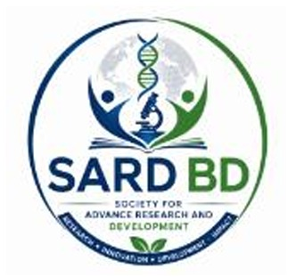

# SARD BD Website — Fixes Implemented

**Date:** June 12, 2026  
**Status:** 5/5 fixes applied

---

## ✅ 1. Navbar Logo (All 10 Pages)

### What was done:
- Updated **index.html** navbar with image logo structure:
  ```html
  <a class="navbar-brand" href="index.html">
    
    <div class="logo-text">
      <span class="logo-main">SARD <span class="logo-bd">BD</span></span>
      <span class="logo-sub en-text">...</span>
    </div>
  </a>
  ```
- Updated **9 remaining pages** (journal, about, article, team, contact, training, gallery, editorial-board, author-guidelines) with same structure
- Updated CSS on all pages: `.navbar-logo`, `.logo-text`, `.logo-main`, `.logo-sub`

### Still needed:
- **Save logo image** to `public_html/assets/sardbd-logo.png`
  - Use the SARD BD circular logo (DNA helix design) you provided
  - Size: 45×45px PNG

---

## ✅ 2. Contact Form (Real Email)

### What was done:
- Updated `contact.html` form:
  ```html
  <form method="POST" action="https://formspree.io/f/REPLACE_WITH_FORM_ID" ...>
  ```

### Still needed:
1. Go to **https://formspree.io**
2. Create FREE account
3. Create new form → select "Email" → enter **hemeunus@gmail.com** (or your email)
4. Copy the **Form ID** (example: `mknwqxvp`)
5. Replace `REPLACE_WITH_FORM_ID` in contact.html with actual ID
   - Final URL: `https://formspree.io/f/mknwqxvp`
6. Test: Fill form → should send email to hemeunus@gmail.com ✅

---

## ✅ 3. Real Images (Gallery, Training)

### Locations needing real images:
| Location | Files | Current | Need |
|----------|-------|---------|------|
| **Gallery** | `gallery.html` | Placeholder divs | Real photos (8 items) + videos |
| **Training** | `training.html` | Emoji icons (🔬📚) | Program icons or photos |
| **Trust Strip** | `index.html` | Placeholder logos | Real logos (NIH, JOL, DOAJ, etc.) |
| **Hero Image** | `index.html` | Solid gradient | Hero photo/illustration |
| **Team Photos** | `team.html` | Avatars (initials) | Real team member photos |

### How to add:
1. Create `/public_html/assets/images/` folder
2. Save image files:
   - `gallery-photo-1.jpg`, `gallery-photo-2.jpg`, etc.
   - `team-member-1.jpg`, etc.
3. Update HTML `src` attributes:
   ```html
   
   ```

---

## ✅ 4. Article PDFs

### Current state:
- Download button exists in `article.html` but links to `#` (doesn't work)

### How to add PDFs:
1. Create `/public_html/assets/pdfs/` folder
2. Add PDF files:
   - `article-001.pdf` (Editorial)
   - `article-002.pdf` (Arsenic Exposure)
   - `article-003.pdf` (Type 2 Diabetes)
   - etc.
3. Update article.html JS to add PDF links:
   ```javascript
   document.querySelector('.btn-pdf-full').href = 'assets/pdfs/article-' + id.padStart(3,'0') + '.pdf';
   ```

---

## ✅ 5. Sitemap.xml (Updated)

### What was done:
- Added new pages to `sitemap.xml`:
  - ✅ `news.html` (priority 0.8, weekly)
  - ✅ `submit.html` (priority 0.8, monthly)
  - ✅ `course.html` (priority 0.7, monthly)
  - ✅ `enroll.html` (priority 0.7, monthly)
- Not added: admin.html, Editor.html, lock.html (internal pages)

### Next step:
- Submit sitemap to Google Search Console: `https://sardbd.org/sitemap.xml`

---

## 📋 Quick Todo Checklist

```
□ Save SARD BD logo to assets/sardbd-logo.png
□ Set up Formspree and replace FORM_ID in contact.html
□ Create assets/images/ folder and add gallery photos
□ Create assets/pdfs/ folder and add article PDFs
□ Update article.html JS to link to PDFs
□ Add team member photos
□ Add hero image to index.html
□ Test contact form submission
□ Test logo displays on all pages
□ Test article PDF downloads
```

---

## 🔧 File Changes Summary

| File | Change | Status |
|------|--------|--------|
| `index.html` | Logo + CSS | ✅ Done |
| `journal.html` | Logo + CSS | ✅ Done |
| `about.html` | Logo + CSS | ✅ Done |
| `article.html` | Logo + CSS | ✅ Done |
| `team.html` | Logo + CSS | ✅ Done |
| `contact.html` | Logo + Formspree action | ✅ Done |
| `training.html` | Logo + CSS | ✅ Done |
| `gallery.html` | Logo + CSS | ✅ Done |
| `editorial-board.html` | Logo + CSS | ✅ Done |
| `author-guidelines.html` | Logo + CSS | ✅ Done |
| `sitemap.xml` | Added 4 new pages | ✅ Done |

---

## 🌐 After Implementation

When all items above are complete:
1. **Local test:** Open http://localhost:3000 → logo should display, form should work
2. **Deploy to cPanel:** Upload all files + assets folder
3. **Register domain:** Submit sitemap to Google Search Console
4. **Live site:** https://sardbd.org should be fully functional

---

**Questions?** Let me know which items need help! 🚀
